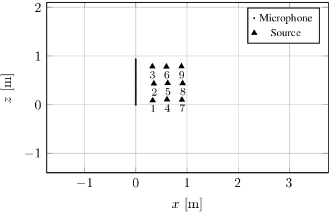

# Dataset for RS-MNMF

This dataset has been developed for "Ray-Space-Based Multichannel Nonnegative Matrix Factorization" IEEE Signal Processing Letter (DOI: 10.1109/LSP.2021.3055463).

Folder ``sources`` contains room impulse responses (RIRs) acquired by two [_eSticks_] uniform linear array (32 microphones) and nine sources in a office room with an average T60 of 40ms.
The distance between two consecutive microphones is d = 0.03 m giving an aliasing frequency ≈ 5782 Hz.
The array and the sources lie on a plane with an approximate distance of 1.5 m from the floor of the room. 
A sketch of the setup and further details are available in the SPL paper.
The RIRs corresponding to the sources are stored in the 32-channels ``.wav`` files named accordingly to the source label. 
The signals are recorded at 48kHz.
The estimated locations of the sources are stored as a 9x2 matrix in ``source_location.mat`` file.

The mesurements were performed by Mirco Pezzoli (mirco.pezzoli -at- polimi.it) at the Image and Sound Processing Lab of Politecnico di Milano. 

If you use this dataset please cite the following papers:

``
M. Pezzoli, J. J. Carabias-Orti, M. Cobos, F. Antonacci,and A. Sarti. 
"Ray-space-based multichannel nonnegative matrix factorization for audio 
source separation". IEEE Signal Processing Letters (2021).
doi: 10.1109/LSP.2021.3055463
``

``
M.Pezzoli, L.Comanducci, J.Waltz,A.Agnello, L.Bondi, A.Canclini, and A. Sarti.
“A dante powered modular microphone array system”, 
in Audio Engineering Society Convention 145. Audio Engineering Society, 2018.
`` 

[_eSticks_]: https://github.com/polimi-ispl/ebeamer